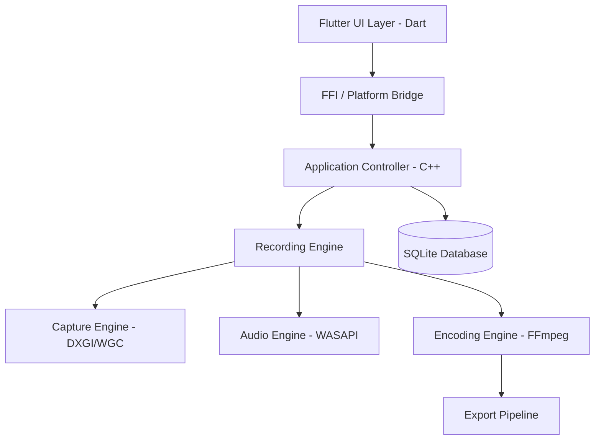

# 🎥 CodeStudio Recorder

[](https://github.com/khandev1211-cpu/CodeStudioRecorder/actions)
[](https://opensource.org/licenses/MIT)
[](https://www.microsoft.com/windows)
[](https://flutter.dev)
[](https://isocpp.org/)

**CodeStudio Recorder** is a high-performance, professional-grade screen recording platform engineered for Windows. Built with a specialized C++20 Native Engine and a modern Flutter interface, it is designed specifically for developers, educators, and technical content creators who demand low-latency captures, hardware acceleration, and real-time AI-driven enhancements.

---

## 📸 Visual Overview

<table>
  <tr>
    <td align="center" width="50%">
      
      <br />
      <sub><b>Main Dashboard</b> — Modern Material 3 interface for session management</sub>
    </td>
    <td align="center" width="50%">
      
      <br />
      <sub><b>Recording Mode</b> — Native HUD with real-time annotations and cursor effects</sub>
    </td>
  </tr>
  <tr>
    <td align="center" width="50%" colspan="2">
      
      <br />
      <sub><b>Advanced Configuration</b> — Deep control over Audio, Video, AI, and Hardware Encoders</sub>
    </td>
  </tr>
</table>

---

## 🚀 Key Features

### 🖼️ Real-Time Presentation HUD
CodeStudio utilizes a **native transparent overlay layer**, allowing you to see your annotations, cursor highlights, and zoom effects **live** while recording. What you see is exactly what your audience gets.
- **Direct2D Focus:** Real-time cursor highlighting and spotlighting.
- **Global Hook Integration:** Expanding click animations captured system-wide.
- **Smart Zoom:** Smoothed follow-cam that keeps the action centered.
- **Webcam PiP:** Hardware-accelerated webcam overlay via Media Foundation.

### 🎬 High-Performance Recording Engine
- **Zero-Copy Capture:** Leverages **Windows Graphics Capture API (DXGI/D3D11)** for near-zero CPU overhead during frame acquisition.
- **Hardware Acceleration:** Auto-detection and optimization for **NVIDIA (NVENC)**, **AMD (AMF)**, and **Intel (Quick Sync)**.
- **Asynchronous Pipeline:** Multi-threaded encoding prevents UI hangs and ensures stable frame rates even under heavy system load.
- **Texture Pooling:** Pre-allocated GPU buffers for ultra-low latency frame processing.

### 🎙️ Studio-Quality Audio
Full integration with **WASAPI** for crystal clear audio capture.
- **Multi-Source Mixing:** Mix system loopback audio with professional XLR/USB microphones in real-time.
- **Visual Feedback:** Real-time peak meters and level visualizers.

### 🤖 AI-Native Pipeline
| Feature | Status | Description |
| :--- | :--- | :--- |
| **Noise Suppression** | ✅ **Active** | Real-time RNNoise/DeepFilterNet integration to clean mic input. |
| **Silence Detection** | ✅ **Active** | Energy-based VAD to automatically flag "dead air" in the timeline. |
| **Auto-Captions** | ✅ **Active** | Local Whisper (ONNX) inference for real-time speech-to-text. |
| **Smart Zoom** | ✅ **Active** | AI-driven cursor tracking with predictive smoothing. |
| **Smart Highlights** | 🔮 *Planned* | LLM-based activity heuristics for automated highlight reels. |

---

## 🏗️ System Architecture

CodeStudio is built on a modular, multi-layered architecture designed for stability and extensibility.



---

## 🛠️ Technology Stack

- **UI Framework:** Flutter 3.19+ (Dart) with Material 3 Design
- **State Management:** Riverpod
- **Core Engine:** C++20
- **Graphics API:** DirectX 11 / DXGI
- **Audio API:** Windows Audio Session API (WASAPI)
- **Video Processing:** FFmpeg (Hardware Accelerated)
- **AI Inference:** ONNX Runtime (DirectML)
- **Database:** SQLite

---

## 🏁 Getting Started

### Prerequisites
- **OS:** Windows 10 (Version 1903) or later (64-bit)
- **GPU:** DirectX 11 compatible (for hardware acceleration)
- **RAM:** 4GB minimum (8GB+ recommended)

### Installation
1. Download the latest `CodeStudioRecorder_Setup.exe` from the [Releases Page](https://github.com/khandev1211-cpu/CodeStudioRecorder/releases).
2. Run the installer to automatically configure FFmpeg dependencies and system paths.
3. Launch the application; it will perform a one-time system integrity check.

### Building from Source
```powershell
# Clone the repository
git clone https://github.com/khandev1211-cpu/CodeStudioRecorder.git
cd CodeStudioRecorder

# Build Native Engine (C++)
cd windows/native_engine
cmake -B build -DCMAKE_BUILD_TYPE=Release
cmake --build build --config Release

# Build Flutter App
cd ../..
flutter pub get
flutter build windows --release
```

---

## 👨‍💻 Developer Information

**CodeStudio Recorder** is designed and maintained by:

### **Irfan Khan**
*Lead Software Architect & Native Engine Developer*

- **GitHub:** [@khandev1211-cpu](https://github.com/khandev1211-cpu)
- **Project Role:** Lead Developer responsible for the C++ Native Recording Engine, DXGI integration, and AI Pipeline architecture.
- **Mission:** Building high-performance desktop tools that bridge the gap between creative freedom and technical precision.

---

## 🤝 Contributing

We welcome contributions! Please review our [Contribution Guide](docs/19_Contribution_Guide.md) for setup instructions and pull request workflows.

## 📄 License

This project is licensed under the **MIT License** — see the [LICENSE](LICENSE) file for details.

---

<p align="center">
  Built with technical excellence by <b>Irfan Khan</b>
  <br />
  <sub>Professional Screen Recording for the Modern Windows Desktop</sub>
</p>
